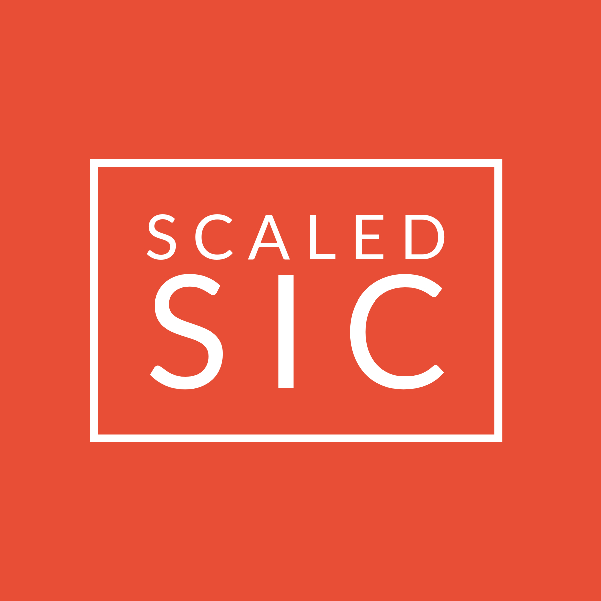

<h1 align="center">
   
  
</h1>

# PublicRelease_2020
## FLOSIC2020

FLOSIC2020 is an electronic structure software package that implements the FERMI-LOWDIN Self-interaction correction (FLO-SIC) method for atoms and molecules.   FLO-SIC removes self-interaction errors from density functional theory calculations. 

## Scaled SIC branch

This branch contains scaled SIC method implemented in the FLOSIC software. Local-SIC, orbital-SIC, and sdSIC are included for performing perturbative and quasi-SCF (i.e. scaled potential) calculations.

## Documentation

For more information on how to use FLOSIC2020, please see the file FLOSIC_Tutorials_and_Documentation.pdf included in the download.

## Support

Help for using FLOSIC2020 can be obtained by using the FLOSIC mail server:  electronic_structure_lab@listserv.utep.edu

## Acknowledgments

FLOSIC2020 was developed with the support of the U. S. Department of Energy, Office of Science, Basic Energy Sciences, Chemical Sciences, Geosciences and Biosciences Division, as part of the Computational Chemical Sciences Program.

## Dependencies 

LAPACK \
BLAS

## For published work employing this software, please cite these articles where it is relevant to your use. 

This software: \
R. R. Zope, Y. Yamamoto, L. Basurto, C. M. Diaz, T. Baruah and K. A. Jackson, FLOSIC software, https://flosic.org/, based on the NRLMOL code of M. R. Pederson.

Parallelization:
Y. Yamamoto, L. Basurto, C. M. Diaz, R. R. Zope, and T. Baruah, “Self-interaction correction to density functional approximations using Fermi-Loewdin orbitals: Methodology and parallelization” (unpublished). 

UTEP NRLMOL: \
C. M. Diaz, L. Basurto, Y. Yamamoto, T. Baruah, and R. R. Zope, UTEP-NRLMOL code (unpublished).

NRLMOL basis: \
D. Porezag and M. R. Pederson, Phys. Rev. A: At. Mol. Opt. Phys. 60, 2840 (1999).

Variational mesh: \
M. R. Pederson and K. A. Jackson, Phys. Rev. B: Condens. Matter Mater. Phys. 41, 7453 (1990).

FLOSIC theory and algorithm: \
M. R. Pederson, A. Ruzsinszky, and J. P. Perdew, J. Chem. Phys. 140, 121103 (2014); \
Z. Yang, M. R. Pederson, and J. P. Perdew, Phys. Rev. A 95, 052505 (2017).

FLOSIC-SCAN/-rSCAN, FLOSIC-libxc, or integration by parts: \
Y. Yamamoto, C. M. Diaz, L. Basurto, K. A. Jackson, T. Baruah and R. R. Zope, J. Chem. Phys. 151, 154105 (2019); \
Y. Yamamoto, A. Salcedo, C. M. Diaz, M. S. Alam, T. Baruah and R. R. Zope, Phys. Chem. Chem. Phys. 22, 18060 (2020).

ADSIC, Slater averaging of SIC potential, FLOSIC-KLI: \
C. M. Diaz, T. Baruah, and R. R. Zope, Phys. Rev. A 103, 042811 (2021); \
C. M. Diaz, P. Suryanarayana, Q. Xu, T. Baruah, J. E. Pask, and R. R. Zope, J. Chem. Phys. 154, 084112 (2021).

## For scaled SIC work, please cite these articles where it is relevant to your use.

Local self-interaction correction (LSIC) method: \
R. R. Zope, Y. Yamamoto, C. M. Diaz, T. Baruah, J. E. Peralta, K. A. Jackson, B. Santra, and J. P. Perdew, J. Chem. Phys. 151, 214108 (2019).

Orbital scaling (OSIC) method: \
O. A. Vydrov, G. E. Scuseria, J. P. Perdew, A. Ruzsinszky, G. I. Csonka, J. Chem. Phys. 124, 094108 (2006);
Y. Yamamoto, S. Romero, T. Baruah, and R. R. Zope, J. Chem. Phys. 152, 174112 (2020).

sdSIC method:\
P. Bhattarai, K. Wagle, C. Shahi, Y. Yamamoto, S. Romero, B. Santra, R. R. Zope, J. E. Peralta, K. A. Jackson, and J. P. Perdew, J. Chem. Phys. 152, 214109 (2020).

BibTex citations are available in /doc/references.bib         

### Lead software development brought to you by UTEP Electronic Structure Lab (2021)
R. R. Zope \
T. Baruah \
L. Basurto \
C. M. Diaz \
Y. Yamamoto 

